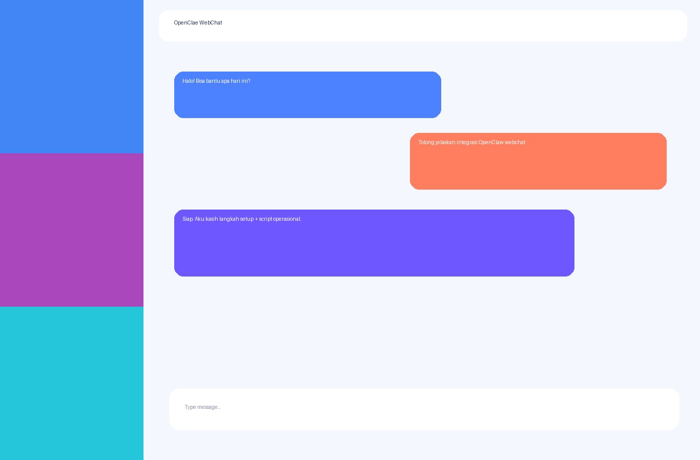
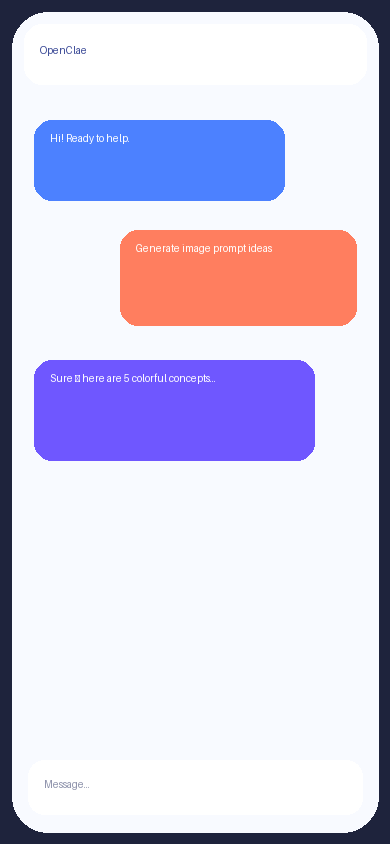
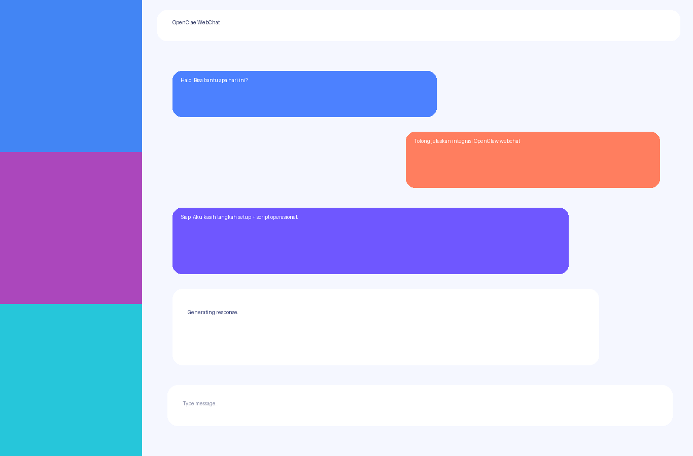

# openclae-webchat

Web chat UI for OpenClaw Gateway, extracted from a production-tested setup and packaged for reuse.

## Features

- Chat sessions + message bubbles
- Streaming responses (SSE)
- Stop generation
- Regenerate last answer
- Edit & resend user messages
- Per-message delete
- Branch from message
- File/image upload support
- Local persistence (`data/chat-store.json`)
- Helper scripts for startup/health/watchdog

## Requirements

- Node.js 18+
- OpenClaw Gateway (default: `http://127.0.0.1:18789`)
- Linux/Termux shell (for helper scripts)

## Quick start

```bash
npm install
npm start
```

Open: `http://127.0.0.1:8080`


## Screenshots / Demo

> Included mock/demo visuals in `docs/assets/` so the README is immediately previewable.

### Desktop



### Streaming in progress


### Mobile view



### Optional demo GIF



## Environment variables

- `PORT` (default `8080`)
- `OPENCLAW_CONFIG` (default `$HOME/.openclaw/openclaw.json`)
- `GATEWAY_TIMEOUT_MS` (default `120000`)
- `WORKSPACE` (optional override for helper scripts)

## Scripts

In `scripts/`:

- `start-chat-stack.sh` — start/check gateway + chat UI + watchdog
- `chatctl.sh` — `up|down|restart|status`
- `gateway-watchdog.sh` — periodic gateway health checker

All scripts auto-detect repo root from script location.

## Security note

This repo excludes personal chat history and uploaded files by default.

## OpenClaw integration guide

See `docs/openclaw-integration.md` for deployment/integration steps.

## Contributing

See `CONTRIBUTING.md` for contribution workflow and local validation steps.

This repository includes:

- issue templates in `.github/ISSUE_TEMPLATE/`
- pull request template in `.github/PULL_REQUEST_TEMPLATE.md`
- changelog in `CHANGELOG.md`
- code of conduct in `CODE_OF_CONDUCT.md`
